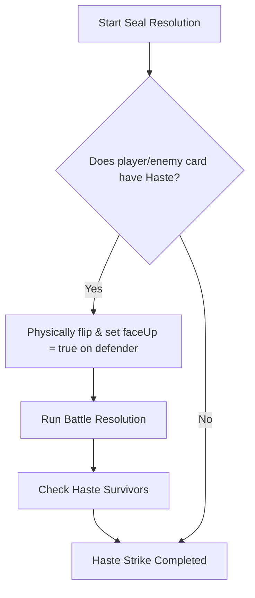

# Endless Seven: Card Resolution Phases & Errata Mapping

This document maps each card's abilities, errata, and implementation rules to the specific steps of the turn and seal resolution phases.

---

## I. Prep Phase (Start of Round)

At the beginning of each round, players draw cards, reinforce lanes face-down, and discard remaining cards to Limbo.

### Cards Active/Resolving in Prep Phase

*   **Kaelarion** (Vampyre/Creature - 4 Power)
    *   *Final Act (Limbo)*: While in Limbo, you may move this card into the Graveyard and place a Champion on top of its owner's deck.
*   **Alistar Elren** (Daemon/Creature - 6 Power)
    *   *Final Act (Limbo)*: Move to Graveyard to place a -3 Weakness Marker on any creature in play.
*   **Golgothane** (Graveborn/Avatar of Darkness - 9 Power)
    *   *Final Act (Limbo)*: Move this creature to the Graveyard and shuffle all the creatures in your enemy's Limbo back into their deck.

---

## II. Seal Phase (Sequential Seals 1 to 7)

Each of the seven Sacred Seals is resolved sequentially. The resolution follows a strict loop divided into six distinct steps.

### Step 0: Haste Strike
Before standard cards are flipped or battle normally, any card with the **Haste** trait strikes immediately.

#### Steps & Errata
*   **Defender Reveal**: The defending card is immediately rotated face-up and marked `faceUp = true` so its details show correctly in the 3D environment and the 2D combat interstitial overlay.
*   **Haste Damage Priority**: If the defending card is destroyed by a Haste Strike, its **Flip** ability is bypassed and never triggers.
*   **Survivor Caching**: If the defending card survives, its initial face-down state is preserved (`pWasFaceDown` / `eWasFaceDown`) so it can still trigger its Flip ability when Step B is reached.

#### Cards Active/Resolving in Step 0
*   **Fenris Lightfoot** (Lycan/Creature - 1 Power)
    *   *Ability*: Has Haste. Battles immediately.
    *   *Errata*: Any creature that battles Fenris Lightfoot is destroyed at the end of the round.
*   **Lucian Blackwood** (Lycan/Creature - 7 Power)
    *   *Ability*: Has Haste. Battles immediately.
    *   *Post-Combat*: Place a +2 Power Marker on this creature after destroying an Enemy creature in battle.
*   **Samyaza** (Celestial/Creature - 6 Power)
    *   *Ability*: Has Haste. Battles immediately.
    *   *Final Act (Limbo)*: Move to Graveyard to Nullify the activation of any creature ability.
*   **Sulvian Vane** (Vampyre/Creature - 5 Power)
    *   *Ability*: Has Haste. Resolves battle before Flip abilities.
    *   *Errata*: Any creature that battles this creature is placed on top of its owner's deck.
*   **Valerius Nightshade** (Vampyre/Creature - 2 Power)
    *   *Ability*: Has Haste.
    *   *Errata*: Any creature battling this creature has its Flip ability Nullified. (Code also steals 1 Power before combat).

---

### Step A: The Flip
Reveal all remaining face-down cards on the active Seal lane.

#### Steps & Errata
*   **Simultaneous Reveal**: All face-down cards are rotated face-up.
*   **Tie Rule Check**: If both cards have equal effective power (base power + power markers - weakness markers), they are both destroyed immediately and the seal remains/becomes Neutral. No flip or activate abilities trigger for them.

### Ability Classification, Timing Windows & Ability Storage

Ability activation timing in Endless Seven follows five distinct categories:

1. **Haste Abilities**: Resolves immediately in **Step 0: Haste Strike** when revealed, performing physical combat before Step A.
2. **Flip Abilities**: Trigger automatically in **Step B: Abilities** when a face-down card is revealed face-up for the first time during seal resolution.
3. **Activate Abilities**: Available during your active turn windows when the card is face-up on the board (once per round). If passed when prompted during seal resolution, the ability is stored in **Ability Storage (Abilities Drawer)** and can be triggered later in the round.
4. **Final Act (Limbo) Abilities**: Can be activated while the card resides in the Limbo zone (moving the card to the Graveyard as a cost). Final Act abilities can be triggered manually at any point during active turn windows or held in **Ability Storage** to respond later in the round.
5. **Passive & Event Triggers**: Active continuously while the card is in play (e.g., Duke Aren Drakos, Valtarious) or trigger on specific game events (e.g., Fenris Lightfoot delayed destruction, Umbarax post-combat power gain).

---

### Step B: Abilities (Flip and Activate)
Abilities are processed in descending order of effective power. If there's a tie, the Tie-Breaker rule applies (AI/enemy first or player first based on configuration/rules).

#### 1. Flip Abilities (Trigger only if the card was face-down at start of resolution)

*   **Bacchus** (Daemon/Creature - 1 Power)
    *   *Flip*: Transfer all Power Markers in play to this creature.
*   **Duke Aren Drakos** (Vampyre/Creature - 6 Power)
    *   *Flip*: Place a creature in play on top of that player's deck.
    *   *Passive*: While in play, all of your creatures are considered Vampyres.
*   **Desire** (Daemon/Creature - 2 Power)
    *   *Flip*: All players sacrifice a creature at this position. If the Seal has no Champion, you may change the influence of this Seal.
*   **Bella** (Avatar of Light - 9 Power)
    *   *Flip*: Destroy any Champion on any Seal.
*   **Dawn** (Avatar of Light - 9 Power)
    *   *Flip*: Gain +1 Power Marker for each Oathbringer in play.
*   **Calmadious** (God of Light - 15 Power)
    *   *Flip*: Purify any Corrupted Seal without a Champion.
*   **Oriel the Bold** (Celestial/Creature - 1 Power)
    *   *Flip*: Change the influence of any Seal without a Champion.
*   **Nix** (Avatar of Darkness - 9 Power)
    *   *Flip*: Choose a creature type, destroy all cards of that type in play.
*   **Bogva** (Daemon/Creature - 7 Power)
    *   *Flip*: Place a -1 Weakness Marker on each of your enemy's creatures.
*   **Cassiel Haggis** (Celestial/Creature - 5 Power)
    *   *Flip*: Reveal the top card of your deck, this creature gains Power Markers equal to that creature's Power Value.
*   **Lycandor** (Avatar of Darkness - 9 Power)
    *   *Flip*: Place a -2 Weakness Marker on all Enemy creatures for each Graveborn you have in play.
*   **Skarados** (God of Darkness - 15 Power)
    *   *Flip*: Corrupt every Purified seal without a Champion.
*   **Pazoo** (Avatar of Darkness - 9 Power)
    *   *Flip*: Gains a +2 Power Marker for each Graveborn in play. You may place any creature from Limbo you control on top of your deck.
*   **Zelus** (Daemon/Creature - 3 Power)
    *   *Flip*: Place a -3 Weakness Marker on any creature in play with a Power Value equal to or greater than this creature.

#### 2. Activate Abilities (Can trigger whether card started face-down or face-up)

*   **Bella** (Avatar of Light - 9 Power)
    *   *Activate*: Destroy one Marker type on any creature.
*   **Dawn** (Avatar of Light - 9 Power)
    *   *Activate*: Win if 4 Oathbringers are in play with at least one Champion controlling a Seal.
*   **Calmadious** (God of Light - 15 Power) / **Skarados** (God of Darkness - 15 Power)
    *   *Activate*: Destroy any one Marker type.
*   **Coal** (Avatar of Light - 10 Power) / **Karlyah** (Avatar of Darkness - 10 Power)
    *   *Activate*: If you control 5 or more Seals with Champions you win the game.
*   **Anakim The Wise** (Celestial/Creature - 3 Power)
    *   *Activate*: Choose a Seal. Enemy may not Champion or Influence that Seal until the end of the round.
    *   *Passive*: Cannot be destroyed by battle this turn.
*   **Mammon** (Daemon/Creature - 5 Power)
    *   *Activate*: Transfer all Power Markers in play to this creature.
    *   *Passive*: Cannot be destroyed by battle this turn.
*   **Ulfric Thorne** (Lycan/Creature - 6 Power)
    *   *Activate*: Place a +2 Power Marker on any creature.
    *   *Passive*: Cannot be destroyed by battle this turn.
*   **Varg Fur-back** (Lycan/Creature - 3 Power)
    *   *Activate*: Sacrifice this creature and place a +3 Power Marker on any creature.
*   **Nix** (Avatar of Darkness - 9 Power)
    *   *Activate*: If you have 4 Graveborn in play with at least one Champion controlling a Seal, you win the game.

---

### Step C: Alignment Influence
The victorious or uncontested lane side influences the Seal's alignment (Purify for Light, Corrupt for Dark).

*   **Ability Defender Removal Rule**: If a player uses an ability to destroy, exile, or send an opponent's defender to the Graveyard or Limbo, that player claims/influences the Seal during Step D (Siege), **even if they have no card present in that lane slot**.
*   **Bounce Exception**: Returning an opponent defender to their owner's **Hand** or to the top/bottom of their **Deck** (e.g. via \`Sulvian Vane\` or bounce abilities) does **NOT** trigger this Seal alignment change if your lane slot is empty.

---

### Step D: Battle
Standard combat occurs between survivors in the lane.

#### Cards Active/Resolving in Step D (Combat & Battle resolution)
*   **Valerius Nightshade** (Vampyre/Creature - 2 Power)
    *   *Errata*: Steals 1 Power from the opponent creature before combat damage is calculated.
*   **Sulvian Vane** (Vampyre/Creature - 5 Power)
    *   *Errata*: Any creature that battles Sulvian Vane is placed on top of its owner's deck, regardless of the battle outcome.
*   **Noble The Great** (Avatar of Light - 9 Power)
    *   *Errata*: After destroying a creature in battle, you may destroy another creature or Marker type in play.
*   **Umbarax** (Avatar of Darkness - 9 Power)
    *   *Errata*: After Umbarax destroys a creature in battle place a +2 Power marker on this creature for each Graveborn in play. (Also cannot be destroyed by battle this turn via Flip).

---

### Step E: Ascension
If the lane is clear of defenders or the Seal was empty, and the survivor is a **Champion**, they ascend to occupy the Seal.

#### Cards Active/Resolving in Step E
*   **Coal** (Avatar of Light - 10 Power)
    *   *Final Act (Limbo)*: While in Limbo, you may move this creature into the Graveyard to stop a creature from Championing a Seal.

---

## III. Cleanup Phase (End of Round)

Resolves duplicate cards, end-of-round sacrifices, and victory tallies.

### Cards Active/Resolving in Cleanup Phase
*   **Cyprian** (Vampyre/Creature - 1 Power)
    *   *Errata*: Sacrifice this creature at the end of the turn.
*   **Fenris Lightfoot** (Lycan/Creature - 1 Power)
    *   *Errata*: Destroys the creature that battled Fenris earlier in the round.
