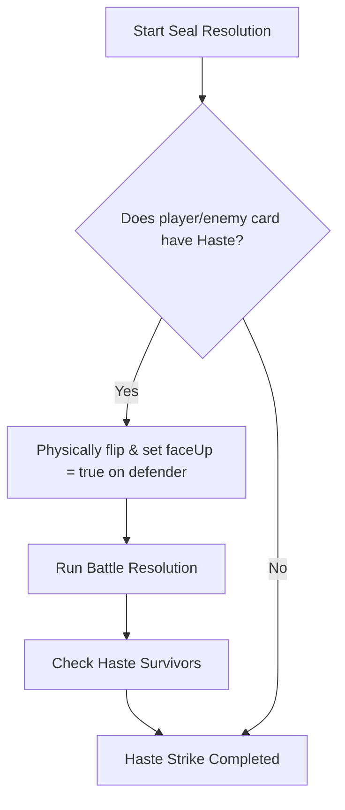

# Endless Seven: Card Resolution Phases & Errata Mapping

This document maps each card's abilities, errata, and implementation rules to the specific steps of the turn and seal resolution phases.

---

## I. Prep Phase (Start of Round)

At the beginning of each round, players draw cards, reinforce lanes face-down, and discard remaining cards to Limbo.

### Cards Active/Resolving in Prep Phase

*   **Kaelarion** (Celestial/Creature - 4 Power)
    *   *Final Act (Limbo)*: While in Limbo, you may move this card to the Graveyard to summon a Celestial from Limbo to the Battlefield.
    *   *Step*: Triggers during the Prep Phase when reinforcing lanes or at the start of the round to resurrect units.
*   **Alistar Elren** (Celestial/Creature - 4 Power)
    *   *Final Act (Limbo)*: Move to Graveyard to place +2 Power Markers on a Celestial.
*   **Golgothane** (Daemon/Creature - 4 Power)
    *   *Final Act (Limbo)*: Move to Graveyard to summon a Daemon from Limbo to the Battlefield.

---

## II. Seal Phase (Sequential Seals 1 to 7)

Each of the seven Sacred Seals is resolved sequentially. The resolution follows a strict loop divided into six distinct steps.

### Step 0: Haste Strike
Before standard cards are flipped or battle normally, any card with the **Haste** trait strikes immediately.

#### Steps & Errata
*   **Defender Reveal**: The defending card is immediately rotated face-up and marked `faceUp = true` so its details show correctly in the 3D environment and the 2D combat interstitial overlay.
*   **Haste Damage Priority**: If the defending card is destroyed by a Haste Strike, its **Flip** ability is bypassed and never triggers.
*   **Survivor Caching**: If the defending card survives, its initial face-down state is preserved (`pWasFaceDown` / `eWasFaceDown`) so it can still trigger its Flip ability when Step B is reached.

#### Cards Active/Resolving in Step 0
*   **Fenris Lightfoot** (Lycan/Creature - 1 Power)
    *   *Ability*: Has Haste. Battles immediately.
    *   *Errata*: Any creature that battles Fenris Lightfoot is destroyed at the end of the round.
*   **Zelus** (Horseman/Creature - 6 Power)
    *   *Ability*: Has Haste. Battles immediately.
    *   *AI Logic*: AI Zelus will not initiate friendly fire when selecting targets.
*   **Lucian Blackwood** (Vampyre/Creature - 4 Power)
    *   *Ability*: Has Haste. Battles immediately.
    *   *Post-Combat*: Gains +2 Power Markers if it wins the combat.
*   **Samyaza** (Daemon/Creature - 6 Power)
    *   *Ability*: Has Haste. Battles immediately.
    *   *Final Act (Limbo)*: Move to Graveyard to nullify an opponent's card ability.

---

### Step A: The Flip
Reveal all remaining face-down cards on the active Seal lane.

#### Steps & Errata
*   **Simultaneous Reveal**: All face-down cards are rotated face-up.
*   **Tie Rule Check**: If both cards have equal effective power (base power + power markers - weakness markers), they are both destroyed immediately and the seal remains/becomes Neutral. No flip or activate abilities trigger for them.

---

### Step B: Abilities (Flip and Activate)
Abilities are processed in descending order of effective power. If there's a tie, the Tie-Breaker rule applies (AI/enemy first or player first based on configuration/rules).

#### 1. Flip Abilities (Trigger only if the card was face-down at start of resolution)

*   **Bacchus** (Daemon/Creature - 1 Power)
    *   *Flip*: Transfer all Power Markers in play to Bacchus.
*   **Duke Aren Drakos** (Vampyr/Creature - 6 Power)
    *   *Flip*: Return any creature in play to the top of its owner's deck.
    *   *Passive*: While in play, all of your creatures are considered Vampyres.
*   **Desire** (Avatar of Dark - 9 Power)
    *   *Flip*: Forces mutual sacrifice (destroying itself and the opposing card). If the Seal has no Champion, you may change the influence of the Seal to Light or Dark.
*   **Bella** (Avatar of Light - 9 Power)
    *   *Flip*: Destroy any Champion on any Seal.
*   **Dawn** (Avatar of Light - 9 Power)
    *   *Flip*: Gain +1 Power Marker for each Oathbringer/Light card in play.
*   **Calmadious** (God of Light - 15 Power)
    *   *Flip*: Purify any Corrupted Seal without a Champion.
*   **Oriel the Bold** (Celestial/Creature - 1 Power)
    *   *Flip*: Change the influence of any one Seal without a Champion.
*   **Death** (Horseman/Creature - 15 Power)
    *   *Flip*: Choose a creature type (Avatar, Horseman, God, Vampyre, Lycan, Celestial, Daemon), destroy all cards of that type in play.
*   **Bogva** (Celestial/Creature - 3 Power)
    *   *Flip*: -1 Weakness marker on each enemy creature.
*   **Cassiel Haggis** (Celestial/Creature - 3 Power)
    *   *Flip*: Gains Power Markers equal to the base power of the top card of owner's deck.
*   **Lycandor** (Lycan/Creature - 3 Power)
    *   *Flip*: Place +2 Power Markers on adjacent creatures (each adjacent creature). Only flipped cards are affected.
*   **Pazoo** (God of Dark - 15 Power)
    *   *Flip*: Corrupt any Purified Seal without a Champion.

#### 2. Activate Abilities (Can trigger whether card started face-down or face-up)

*   **Bella** (Avatar of Light - 9 Power)
    *   *Activate*: Destroy one marker type (AI Bella targets enemy Power markers or friendly Weakness markers).
*   **Dawn** (Avatar of Light - 9 Power)
    *   *Activate*: Win if 4 Oathbringers are in play with at least one Champion controlling a Seal.
*   **Calmadious** (God of Light - 15 Power)
    *   *Activate*: Destroy any one marker type (Almighty/Destroyer marker choice).
*   **Coal** (Avatar of Light - 10 Power)
    *   *Activate*: Win if controlling 5 or more Seals with Champions.
*   **Anakim The Wise** (Celestial/Creature - 3 Power)
    *   *Activate*: Choose a Seal. Enemy may not Champion or Influence that Seal until the end of the round.
    *   *Passive*: Cannot be destroyed by battle this turn.
*   **Mammon** (God of Dark - 15 Power) / **Ulfric Thorne** (God of Dark - 15 Power)
    *   *Activate*: Gains battle invulnerability this turn.
*   **Varg Fur-back** (Lycan/Creature - 6 Power)
    *   *Activate*: Readies end-of-round sacrifice (sacrifices itself to place +2 Power Markers on each adjacent ally creature).
*   **Nix** (Avatar of Dark - 9 Power)
    *   *Activate*: Choose a creature type, return all cards of that type in play to owners' decks.
*   **Karlyah** (Avatar of Dark - 9 Power)
    *   *Activate*: Transfer all Weakness Markers in play to this creature.
    *   *Final Act (Limbo)*: Move to Graveyard to place +3 Weakness Markers on the creature that destroyed it.

---

### Step C: Alignment Influence
The victorious or uncontested lane side influences the Seal's alignment (Purify for Light, Corrupt for Dark).

*   *Note*: No specific card errata modifies the base alignment influence rules during this step.

---

### Step D: Battle
Standard combat occurs between survivors in the lane.

#### Cards Active/Resolving in Step D (Combat & Battle resolution)
*   **Valerius Nightshade** (Vampyr/Creature - 6 Power)
    *   *Errata*: Steals 1 Power from the opponent creature before combat damage is calculated.
*   **Sulvian Vane** (Vampyr/Creature - 6 Power)
    *   *Errata*: Any creature that battles Sulvian Vane is placed on top of its owner's deck, regardless of the battle outcome.
*   **Noble The Great** (Avatar of Light - 9 Power)
    *   *Errata*: After destroying a creature in battle, you may destroy another card or Marker in play.

---

### Step E: Ascension
If the lane is clear of defenders or the Seal was empty, and the survivor is a **Champion**, they ascend to occupy the Seal.

#### Cards Active/Resolving in Step E
*   **Coal** (Avatar of Light - 10 Power)
    *   *Final Act (Limbo)*: While in Limbo, you may move this card to the Graveyard to stop an enemy creature from Championing a Seal.
    *   *Errata*: The opponent receives an **Action Required** prompt asking if they want to discard Coal to block the ascension.

---

## III. Cleanup Phase (End of Round)

Resolves duplicate cards, end-of-round sacrifices, and victory tallies.

### Cards Active/Resolving in Cleanup Phase
*   **Varg Fur-back** (Lycan/Creature - 6 Power)
    *   *Errata*: Resolves the pending sacrifice, destroying itself to apply +2 Power Markers to adjacent ally creatures.
*   **Fenris Lightfoot** (Lycan/Creature - 1 Power)
    *   *Errata*: Destroys the creature that battled Fenris earlier in the round.
